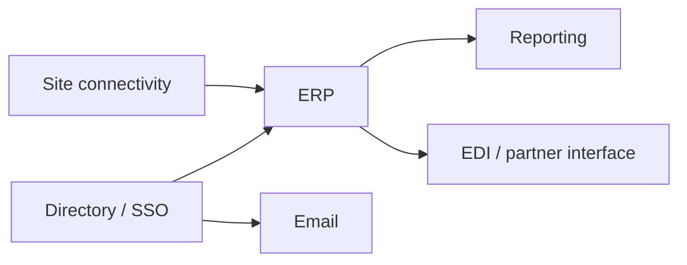

# System Landscape Documentation

Produces a document that answers, for one organisation: what systems exist, what each
one is for, who owns it, what depends on it, and where the risks are. The audience is
IT leadership and management — people who need to make decisions about the estate, not
engineers looking for a runbook.

Most organisations that need this have nothing written down, or have a diagram that
stopped being true two years ago. The value is in the discovery and the honesty about
gaps, not in the formatting.

## When this applies

- No current documentation of the technology estate, or documentation nobody trusts
- A new IT lead, CIO or vCISO taking over an environment
- Preparing for an audit, certification or due diligence
- Before a migration, consolidation or carve-out
- After an incident exposed a dependency nobody had written down

Do not use this for a single-system runbook, for a network topology drawing alone, or
when the organisation already has a maintained CMDB — in that case the work is
reconciliation, not discovery.

## Inputs to gather first

Establish these before any discovery questions. Ask; do not assume.

1. **Scope** — whole organisation, one site, one business unit, or one domain
   (e.g. only business applications). A landscape that tries to cover everything at
   once never gets finished.
2. **Audience and purpose** — board paper, audit evidence, handover, or working
   document for the IT team. This decides the depth and what gets left out.
3. **Sources available** — who can be interviewed, what access exists (asset lists,
   licence portals, monitoring, invoices), and what is off limits.
4. **Sensitivity** — whether the result will be shared outside the organisation, and
   whether hostnames, IPs, supplier names and user counts can appear.

## Procedure

### 1. Discover in rounds, not in one questionnaire

Work through `reference/discovery-questions.md`. Ask **one category at a time** and
react to the answers. Dumping forty questions at someone produces forty short answers
and no useful detail.

Two techniques that reliably surface what interviews miss:

- **Follow the money.** Ask for the last twelve months of IT invoices and subscription
  charges. Systems nobody mentions still get paid for.
- **Follow the work.** Walk through a normal business day — an order arriving, an
  invoice going out, a new employee starting — and note every system touched. This
  catches the spreadsheet that runs a process and the Access database from 2009.

### 2. Collect the technical inventory

For Windows servers and workstations, do not rely on memory. Walk the user through
running the read-only scripts in `collect/` on their own machines and reading the
output back.

The user runs the commands; this skill never connects to anything and never asks for
credentials. That keeps the person accountable for those systems in control of what
leaves them, and it works in environments where remote access for an AI tool would
never be approved.

Start with one non-critical server and one script:

```powershell
.\Get-ServerInventory.ps1 -OutputPath C:\Temp\SRV01-inventory.json
```

Have them open the file and read it before sending anything. Then summarise what it
says and ask the questions it raises — uptime of 400 days, a disk at 6% free, an OS
past end of support. The output is a conversation starter, not an answer.

`reference/collection-guide.md` has the full sequence, what each script covers, what to
flag in the output, and what to say about sensitive fields before anything is pasted
back.

Script output fills the factual columns only. Ownership, criticality and purpose still
come from people — do not present a collection run as a finished landscape.

### 3. Build the inventory

Record each system against the schema in `reference/inventory-schema.md`. Fill what is
known. Where something is unknown, write **Unknown** — never guess a version, an EOL
date, a backup schedule or an owner. An inventory whose gaps are visible is more useful
than one that looks complete.

Criticality is a **business** judgement. Ask the business owner how long they can work
without the system before it hurts, and record their answer. Do not let IT assign it
alone, and do not infer it from how much the system cost.

### 4. Map dependencies

For each system, record what it depends on and what depends on it. Then draw the map
with Mermaid so it lives in the document as text and can be updated:



Keep it to the systems that matter. A map with sixty boxes communicates nothing.

Then identify, explicitly:

- Systems with **no redundancy** whose failure stops the business
- Systems that depend on **one person's knowledge**
- Integrations nobody owns
- Anything reachable from the internet

### 5. Flag the gaps

Go through the checklist at the end of `reference/inventory-schema.md`. Each finding
gets: what is missing, the concrete consequence, and a suggested owner and timeframe.

State consequences plainly and without drama. "Backups run nightly but a restore has
never been tested" is enough — it does not need "catastrophic data loss risk" attached.

### 6. Verify before presenting

- Every system in the inventory traces to a source (interview, invoice, console,
  monitoring) — record it
- Every "Unknown" is genuinely unknown, not unasked
- Criticality ratings were confirmed by the business owner, not assigned by IT
- The dependency map matches the inventory — no system in one and absent from the other
- No invented version numbers, EOL dates or contract renewal dates

Send the draft to the people interviewed before it goes anywhere else. They will correct
things, and that correction round is where the document stops being a guess.

## Output format

Two deliverables, in that order.

### The one-page visual

`templates/landscape-diagram.html` is a dark-themed A3 landscape page: the estate as
a grid of category panels, each listing the real systems with owner and tier, colour
coded — normal, finding, not established.

Fill it from the inventory. Keep the structure, replace the data, and drop panels that
do not apply. Rules that matter:

- **Name the system, not the category.** "SAP Business One", not "ERP". A page that
  says ERP / CRM / Firewall is a stock diagram and tells the reader nothing they did
  not already know.
- **Findings are marked, not hidden.** `class="gap"` for anything unsupported,
  unowned or unprotected; `class="unknown"` for what was not established. A page with
  no red on it either describes a remarkable estate or an incurious survey.
- **Four to eight items per panel.** This is a summary. The inventory lives in the
  document.
- **One page.** If it does not fit, it is too detailed for this artefact.

To PDF: `templates/Export-LandscapePdf.ps1` drives Edge or Chrome headless, or the
user prints with Ctrl+P — A3 landscape, margins none, **background graphics on**,
without which the dark page prints white.

The visual is what gets shown in a meeting. It is not the deliverable on its own: it
carries no consequences, no owners and no timeframes.

### The document

Produce **two documents: English and European Portuguese (pt-PT)**. Same structure,
same content. Write the English version first, then the Portuguese one — not a
machine-style transliteration, but written as a Portuguese IT document reads. Keep
technical terms in English where that is the industry norm in Portugal (firewall,
backup, cloud, endpoint); translate the surrounding prose. Use pt-PT spelling and
conventions, never pt-BR.

Structure of each:

1. **Purpose, scope and as-of date** — what this covers, what it does not, when it was
   accurate
2. **How to read this** — what criticality levels mean here, what "Unknown" means
3. **Summary** — system count by category, criticality distribution, the five findings
   that matter most
4. **Inventory** — one table per category
5. **Dependency map** — Mermaid diagram plus a short reading of it
6. **Integrations and data flows** — what moves between systems, how, and how often
7. **Gaps and recommendations** — prioritised, each with owner and timeframe
8. **Maintenance** — who updates this, how often, and what triggers an update
9. **Appendix** — sources and interview log

If the document will leave the organisation, produce a redacted variant: no hostnames,
no IPs, no user names, supplier names generalised.

## Gotchas

- **People describe the systems they think about.** The ones that just work go
  unmentioned — file shares, print, DNS, the certificate that expires in March.
  Ask about them directly.
- **Shadow IT will not be volunteered.** It surfaces through invoices, OAuth grants in
  the identity provider, and "how do you actually do that" questions.
- **"We have backups" is not a finding.** "When was the last successful restore test"
  is. Ask that question every time.
- **The org chart is not the ownership model.** Ask who is called when the system
  breaks at 19:00 — that is the real owner.
- **Criticality inflation.** If everything is critical, nothing is. Force a ranking by
  asking what gets restored first, second and third.
- **Do not let the document become a diagram.** The picture is the smallest part; the
  inventory and the gap list are what get used.
- **Script output is not a landscape.** It is accurate about machines and silent about
  meaning. A document built only from JSON tells you a server has 64 GB of RAM and
  nothing about why it exists or who cares if it stops.
- **Never ask for credentials, and never offer to connect.** The user runs the scripts
  on their own systems. Anything else changes what this is.
- **It goes stale immediately.** Section 8 is not optional. A landscape document with
  no named maintainer is a snapshot of one afternoon.

## Reference files

- `reference/inventory-schema.md` — system categories, the attributes to capture per
  system, and the gap checklist
- `reference/discovery-questions.md` — interview questions grouped by category
- `reference/collection-guide.md` — how to guide the user through the scripts, what to
  flag in the output, and how to handle sensitive fields

## Templates

- `templates/landscape-diagram.html` — the one-page visual, A3 landscape, print-ready
- `templates/Export-LandscapePdf.ps1` — renders it to PDF with Edge or Chrome

## Collection scripts

All read-only. The user runs them; this skill never connects to anything.

- `collect/Get-ServerInventory.ps1` — hardware, OS, disks, network, roles, uptime
- `collect/Get-InstalledSoftware.ps1` — installed software and patch recency
- `collect/Get-ServiceProfile.ps1` — services, scheduled tasks, listening ports, shares
- `collect/Get-SecurityBaseline.ps1` — local admins, encryption, firewall, legacy protocols
- `collect/Invoke-LandscapeCollection.ps1` — runs the four across a list of machines

Windows only. For Linux, appliances, hypervisors and SaaS, use the interview questions
and each platform's own inventory view, and note in the document which parts were
inventoried by script and which by conversation.
